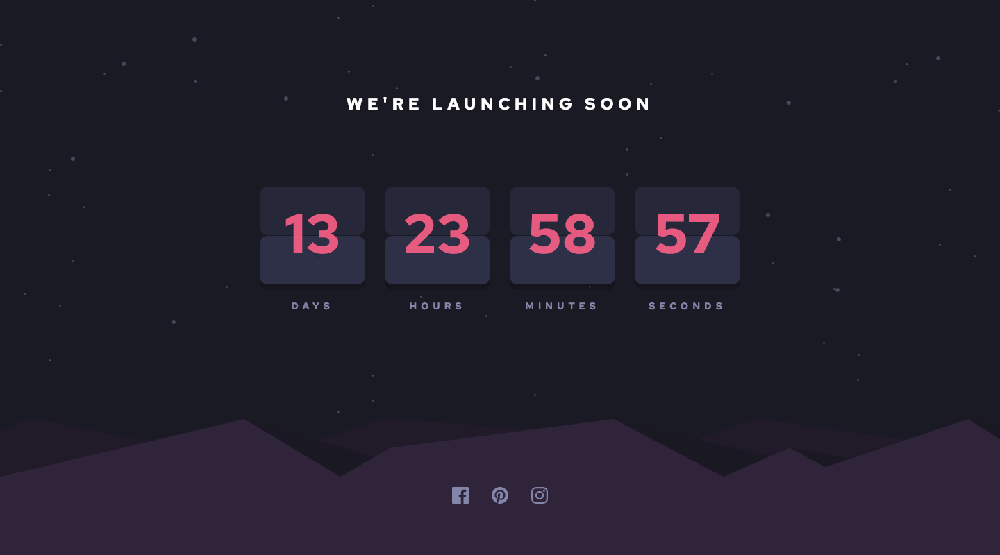

# Frontend Mentor - Launch countdown timer solution

This is a solution to the [Launch countdown timer challenge on Frontend Mentor](https://www.frontendmentor.io/challenges/launch-countdown-timer-N0XkGfyz-). Frontend Mentor challenges help you improve your coding skills by building realistic projects. 

## Table of contents

- [Overview](#overview)
  - [The challenge](#the-challenge)
  - [Screenshot](#screenshot)
  - [Links](#links)
- [My process](#my-process)
  - [Built with](#built-with)
  - [What I learned](#what-i-learned)
  - [Continued development](#continued-development)
- [Author](#author)

## Overview

### The challenge

Users should be able to:

- See hover states for all interactive elements on the page
- See a live countdown timer that ticks down every second (start the count at 14 days)
- **Bonus**: When a number changes, make the card flip from the middle

### Screenshot

### Links

- Solution URL: [Github](https://github.com/Absynthee/launch-countdown-timer-main)
- Live Site URL: [Github Pages](https://absynthee.github.io/launch-countdown-timer-main/)

## My process

### Built with

- Semantic HTML5 markup
- CSS custom properties
- Flexbox

### What I learned

I learned more about svgs, using the `<svg>` tag instead of wrapping it in an ``. More importantly I learned about how to create a timer using Javascript and output the results into the specified fields.

I was unable to do the bonus objective of animating the card. The only ways I could find to do this were to import a jquery file and use their code, but I didn't find one that allowed me enough control over the css to keep the style the same as the design.

### Continued development

Complete the **bonus** objective of making the card flip every interval.

## Author

- Website - [Austin Spillman](https://www.austinspillman.com)
- Frontend Mentor - [@Absynthee](https://www.frontendmentor.io/profile/Absynthee)